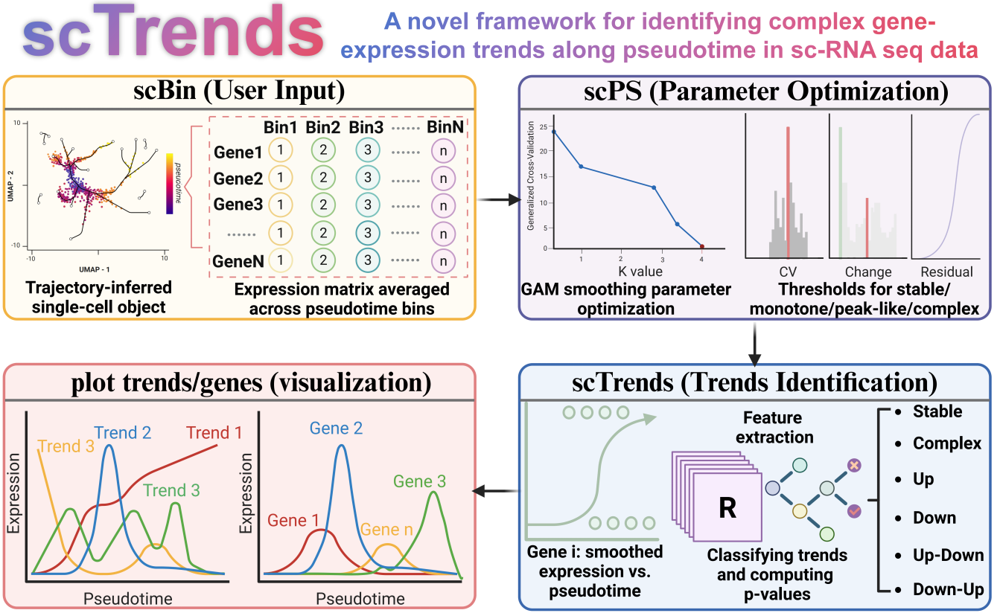
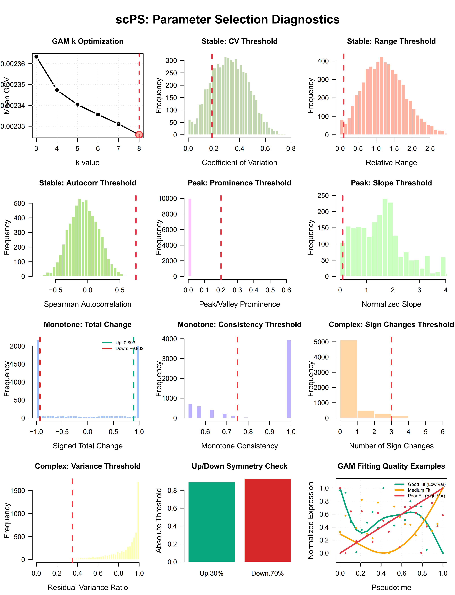
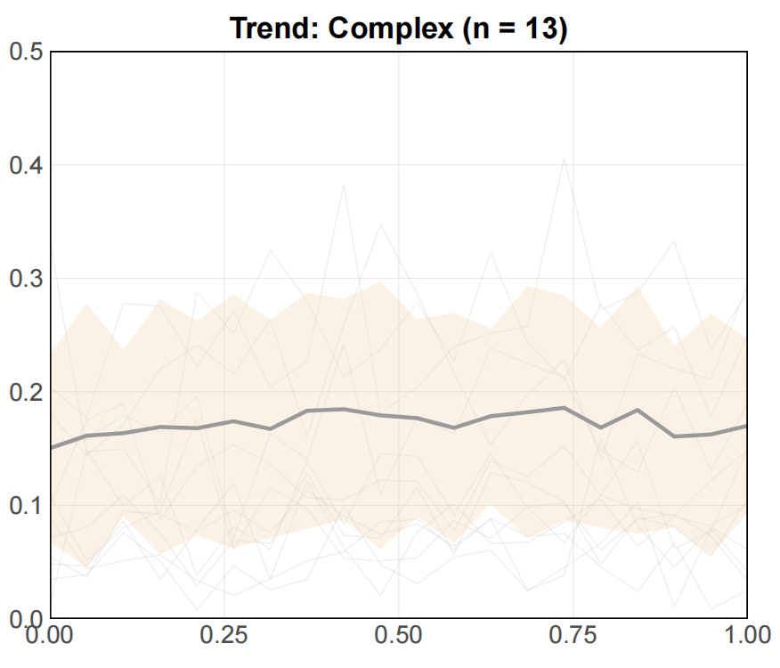

# scTrends

## Introduction



**scTrends** is an R package designed to bridge pseudotime analysis and gene expression trend classification. It provides automated identification and categorization of gene expression dynamics along pseudotime trajectories in single-cell RNA-seq data. scTrends supports data from major single-cell platforms including 10x Genomics, Drop-seq, and Smart-seq2, and is fully compatible with widely-used preprocessing workflows such as Seurat and Scanpy.

### Core Functions

The package comprises five main functions:

1. **`scBin`**: Bin single-cell pseudotime expression profiles
2. **`scPS`**: Automatic parameter selection for scTrends
3. **`scTrends`**: Classify gene expression trends along pseudotime
4. **`plot_trends`**: Visualize gene expression trends along pseudotime
5. **`plot_genes`**: Plot selected genes along pseudotime

### Key Features

- **Lightweight implementation** with minimal dependencies
- **Seurat integration** (version ≥ 5.0.0 required)
- **Eight trend categories**: Stable, Borderline_Stable, Up, Down, Up-Down, Down-Up, Complex, and Insufficient_Data
- **GAM-based feature-rich classification** with permutation testing
- **Automated parameter optimization** via `scPS`

---

## System Requirements

### R Version
- **R ≥ 4.1.0**

### Dependencies

**Imports:**
```
Seurat, Matrix, mgcv, pbapply, doParallel, parallel, 
ggplot2, dplyr, stats, utils, graphics, grDevices, crayon
```

**Suggests:**
```
testthat, knitr, rmarkdown
```

**VignetteBuilder:** knitr

---

## Installation

You can install **scTrends** from GitHub using the following commands:

```r
# Install devtools (if not already installed)
if (!requireNamespace("devtools", quietly = TRUE))
    install.packages("devtools")

# Install scTrends from GitHub
devtools::install_github("746443qjb/scTrends")
```

---

## Getting Started with scTrends

### Data Preparation

We use the **PBMC 3k dataset** as a demonstration. *Note: This is for demonstration purposes only and does not represent actual biological conclusions.*

```r
library(SeuratData)
library(Seurat)
library(scTrends)
library(ggplot2)

# Load and preprocess data
data("pbmc3k")
pbmc <- UpdateSeuratObject(pbmc3k)
pbmc <- NormalizeData(pbmc)
pbmc <- FindVariableFeatures(pbmc, selection.method = "vst", nfeatures = 2000)
pbmc <- ScaleData(pbmc, verbose = TRUE)
pbmc <- RunPCA(pbmc, npcs = 50)
pbmc <- RunUMAP(pbmc, npcs = 50)
print(pbmc)
```

**Output:**
```
An object of class Seurat
13714 features across 2700 samples within 1 assay
Active assay: RNA (13714 features, 2000 variable features)
3 layers present: counts, data, scale.data
1 dimensional reduction calculated: pca
```

---

### Pseudotime Analysis

```r
library(CytoTRACE2)

pbmc <- cytotrace2(pbmc,
                   is_seurat = TRUE,
                   slot_type = "counts",
                   species = "human",
                   seed = 5201314)
```

---

### Binning Expression Profiles (`scBin`)

```r
test <- scBin(
  pbmc,
  pseudotime_col = "CytoTRACE2_Relative",
  assay = "RNA",
  slot = "data",
  n_bins = 20,
  overlap_ratio = 0,
  pseudotime_order = "decreasing",
  x_range = c(0, 1),
  filter_genes = TRUE,
  max_zero_bins_pct = 0,
  min_expression = 0,
  min_cells_per_bin = 20,
  verbose = TRUE
)
```

**Output:**
```
╔══════════════════════════════════════════════════════════╗
║        scBin: Binning Single-Cell Pseudotime Data       ║
╚══════════════════════════════════════════════════════════╝

Step 1: Extracting pseudotime values...
  ✓ Extracted pseudotime for 2700 cells
  Range: [0, 1]

Step 2: Ordering cells by pseudotime...
  ✓ Order: decreasing (early → late)

Step 3: Extracting expression matrix...
  ✓ Matrix dimensions: 13714 genes × 2700 cells
  Assay: RNA | Slot: data

Step 4: Binning cells into 20 bins (no overlap)
  Bin sizes:
    Min: 135 cells
    Max: 135 cells
    Mean: 135 cells

Step 5: Computing bin-averaged expression...
  ✓ Bin-averaged matrix: 13714 genes × 20 bins

Step 6: Filtering genes by expression...
  Filtering criteria:
    Max allowed zero bins: 0 %
    Min expression threshold: 0
  ✓ Filtered out 7616 genes (55.5%)
  ✓ Retained 6098 genes

Step 7: Generating pseudotime coordinates...
  ✓ x range: [0, 1]
  x values: 0, 0.053, 0.105, 0.158, 0.211 ... 1

╔══════════════════════════════════════════════════════════╗
║                         Summary                          ║
╚══════════════════════════════════════════════════════════╝

Total cells: 2700
Total genes (after filtering): 6098
Number of bins: 20
Binning mode: Non-overlapping
Pseudotime order: decreasing
x range: [0, 1]

Gene filtering: ENABLED
  Max zero bins: 0%
  Genes retained: 6098 / 13714 (44.5%)

✓ Binning complete!
```

---

### Automatic Parameter Selection (`scPS`)

```r
PS <- scPS(test, test_genes = 6098, sample_method = "none")
# Note: You can also use sampling, but using all genes is recommended for optimal parameter estimation
```

**Output:**
```
╔══════════════════════════════════════════════════════════╗
║         scPS: Automatic Parameter Selection              ║
║              (Core Parameter Optimization)               ║
╚══════════════════════════════════════════════════════════╝

  Dataset:           6098 genes × 20 bins
  Sampling method:   none
  Threshold method:  quantile
  Using ALL 6098 genes (no sampling)

Optimizing gam_k parameter (testing on 6098 genes)...
  Testing 6 k values on 6098 genes...
  |==============================================| 100%
  • k candidates: 3, 4, 5, 6, 7, 8
  • GCV scores:   0.0024, 0.0023, 0.0023, 0.0023, 0.0023, 0.0023
  ✓ Optimal k = 8

Extracting features from 6098 genes...
  |==============================================| 100%
  ✓ Extracted 6098 feature sets

Computing optimal thresholds...
  • Found 1116 stable candidates

╔══════════════════════════════════════════════════════════╗
║                     Optimal Parameters                   ║
╚══════════════════════════════════════════════════════════╝

Fixed parameters:
  • min_cells:            4
  • peak_position_margin: 0.15
  • max_sign_changes:     1

GAM smoothing:
  • gam_k:                8

Stable detection:
  • CV threshold:         0.185
  • Range threshold:      0.100
  • Autocorr threshold:   0.750

Peak/valley detection:
  • Min prominence:       0.200
  • Min slope:            0.100

Monotone detection:
  • Up threshold:         0.893
  • Down threshold:       -0.932
  • Consistency:          0.750

Complex detection:
  • Min sign changes:     3
  • Variance threshold:   0.350

Tested on 6098 genes
```



---

### Trend Classification (`scTrends`)

```r
# Note: P-value computation is time-consuming. Set compute_pvalue = FALSE if not needed.
test_trends <- scTrends(
  test,
  min_cells = 4,
  peak_position_margin = 0.15,
  max_sign_changes_mono = 1,
  gam_k = 8,
  stable_cv_threshold = 0.185,
  stable_range_threshold = 0.100,
  stable_autocorr_threshold = 0.750,
  min_peak_prominence = 0.200,
  min_slope_ratio = 0.100,
  total_change_up = 0.893,
  total_change_down = -0.932,
  monotone_consistency = 0.750,
  min_sign_changes_complex = 3,
  complex_variance_threshold = 0.350,
  compute_pvalue = FALSE,
  n_perm = 1000,
  alpha = 0.05,
  n_cores = 16,
  use_parallel = TRUE,
  return_details = FALSE,
  verbose = TRUE
)
```

**Output:**
```
╔══════════════════════════════════════════════════════════╗
║           scTrends: Gene Trend Classification            ║
╚══════════════════════════════════════════════════════════╝

Dataset: 6098 genes × 20 bins
Parameters: Stable(CV<0.185), Peak(Prom>0.2), Mono(Up>0.893, Down<-0.932)
P-value: DISABLED

Parallel cluster initialized (16 cores)

Classifying genes...
  |++++++++++++++++++++++++++++++++++++++++++++++++++| 100% elapsed=22s  
✓ Classification complete!

╔══════════════════════════════════════════════════════════╗
║                     Results Summary                      ║
╚══════════════════════════════════════════════════════════╝

  Up                    :  1934 ( 31.7%) |    0 sig
  Down                  :  2058 ( 33.7%) |    0 sig
  Up-Down               :   839 ( 13.8%) |    0 sig
  Down-Up               :   700 ( 11.5%) |    0 sig
  Complex               :   567 (  9.3%) |    0 sig

Total: 6098 genes

✓ Analysis complete!
```

---

## Visualization

### Trend-Level Visualization (`plot_trends`)

```r
plot_trends(
  trend_result = test_trends,
  bin_means = test$bin_means,
  x = test$x,
  trend_type = "Complex",
  max_genes = 30,                  
  sig_metric = "none",
  sig_cutoff = 1,               
  show_individual = TRUE,          
  show_mean = TRUE,                
  show_se = TRUE,                  
  individual_color = "gray80",     
  individual_alpha = 0.3,          
  individual_size = 0.5,           
  mean_color = "#999999",
  mean_size = 1.5,                
  se_fill = "#F5D2A8",           
  se_alpha = 0.3,           
  se_scale = 1.96
) +
  theme_minimal() +
  theme(
    plot.title = element_text(face = "bold", size = 24, hjust = 0.5),
    axis.title = element_blank(),
    axis.text = element_text(size = 20),
    panel.grid.major = element_line(color = "gray90", linewidth = 0.3),
    panel.grid.minor = element_blank(),
    panel.border = element_rect(color = "black", fill = NA, linewidth = 1),
    panel.background = element_rect(fill = "white", color = NA)
  ) +
  coord_cartesian(
    xlim = c(0, 1),    
    ylim = c(0, 0.5),     
    expand = FALSE       
  )
```



---

### Gene-Level Visualization (`plot_genes`)

```r
my_genes <- c("LEF1", "TCF7", "CD27", "CD28")

plot_genes(
  test$bin_means, 
  test$x, 
  genes = my_genes,
  size = 1.2, 
  alpha = 0.5
) +
  labs(
    x = "Pseudotime (0 = Early, 1 = Late)",
    y = "Expression Level"
  ) +
  theme_minimal() +
  theme(
    plot.title = element_text(face = "bold", size = 24, hjust = 0.5),
    axis.title = element_text(size = 24),
    axis.text = element_text(size = 24),
    legend.text = element_text(size = 24),
    legend.title = element_text(size = 24),
    panel.grid.major = element_line(color = "gray90", linewidth = 0.3),
    panel.grid.minor = element_blank(),
    legend.position = "right",
    panel.border = element_rect(color = "black", fill = NA, linewidth = 1),
    panel.background = element_rect(fill = "white", color = NA)
  ) +
  coord_cartesian(
    xlim = c(0, 1),     
    ylim = c(0, 1),      
    expand = FALSE      
  ) +
  guides(color = guide_legend(override.aes = list(size = 5)))
```


---


---

## Contact & Support

For questions, bug reports, or feature requests, please open an issue on our [GitHub repository](https://github.com/746443qjb/scTrends).

---

## License

This project is licensed under the MIT License - see the LICENSE file for details.
